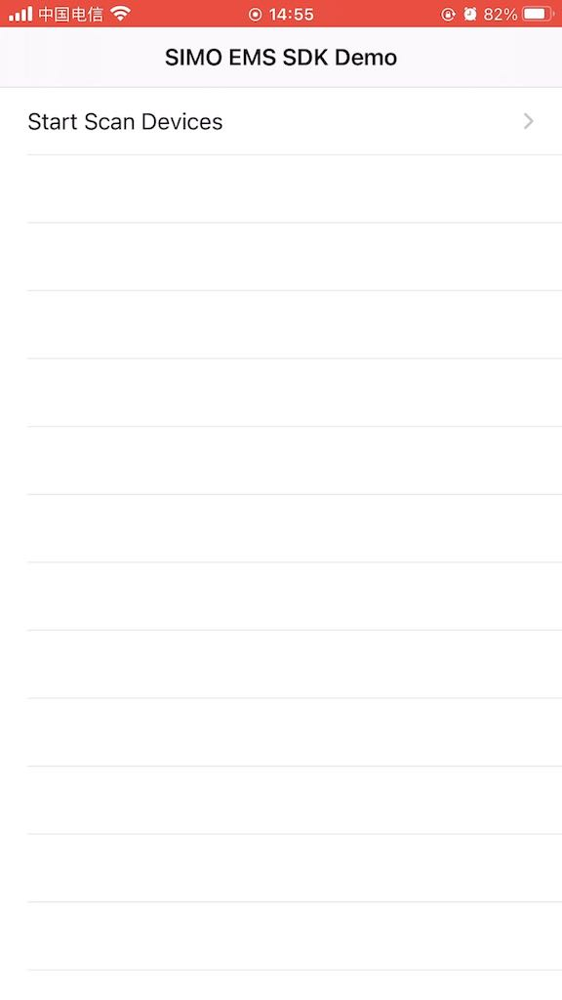
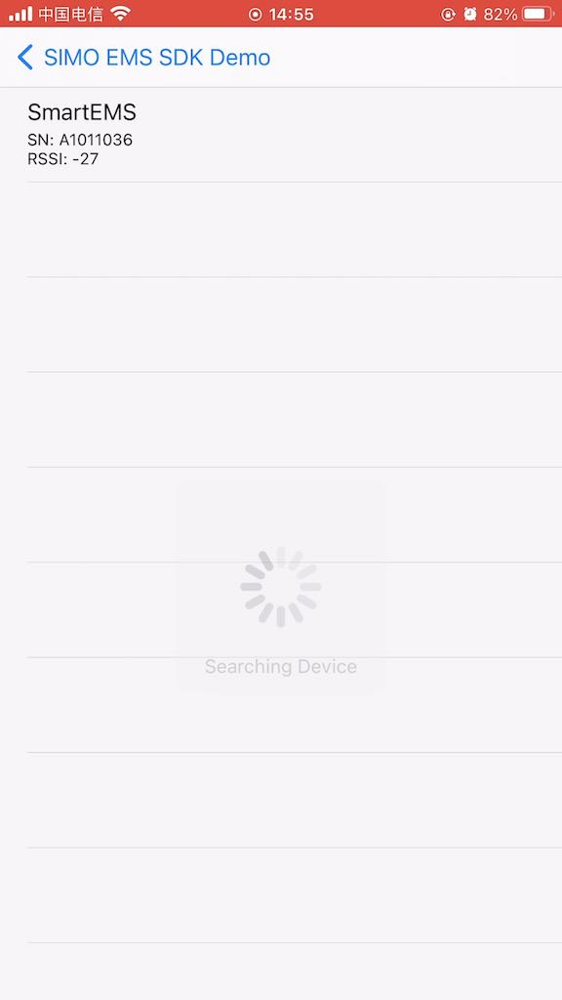
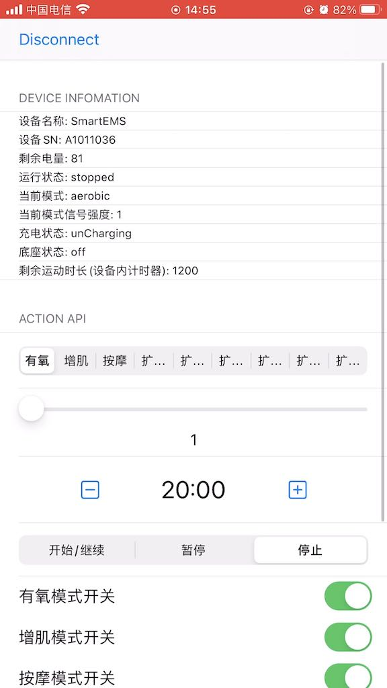

# SMEmsDemo-Confidential-iOS
  

 A iOS SDK and Demo to Control SIMO EMS Device via BLE.

## VersionLog

|version|log|
|:-:|:-:|
|1.1.0| Add OTA and presetConfig API|
|1.0.4| Fixed SN comparing in scanAndConnectDevice missing last 2chars, and fixed timeout param not apply.|
|1.0.3| Delay 1600ms to call discoverService after BLE be connected.|
|1.0.2| Fixed SN missing last 2 chars.|
|1.0.1| Fixed EMS Device's remain exercise second error.|
|1.0.0|First version|

## Installation

> pod 'SMEmsSDK', :git => "https://github.com/Shenzhen-Simo-Technology-co-LTD/SMEmsSDK-iOS.git"

## API

具体操作详见 Demo.

```swift
                      
	 /// 开始扫描设备
    /// 开始扫描后, 通过 **didDiscoverDevice** 代理回调
    /// 代理回调
    /// - Parameters:
    ///   - allowDuplicates: 返回列表中是否允许返回重复的设备
    ///   - updateInterval: 回调间隔, 秒
    ///   - timeoutInterval: 超时时间, 0 则永不超时
    public func startScanEmsDevice(allowDuplicates: Bool = true,
                      updateInterval: Double = 2.0,
                      timeoutInterval: Double = 0.0)
                      
    /// 停止所有扫描操作, 包括重连
    public func stopScan() 
    
    /// 扫描并连接指定的设备
    /// - Parameters:
    ///   - sn: 设备SN 号
    ///   - timeout: 超时时间, 设置为 0 则永不超时
    public func scanAndConnectDevice(_ sn: String, timeout: TimeInterval)
                          
                          
    /// 连接指定设备
    /// - Parameter bleDevice: EMS 设备实例
    public func connecteDevice(_ bleDevice: SMEmsDevice, completion: SMCommonCompletion<Any>? = nil) 
    
    /// 断开指定设备的连接
    /// - Parameter bleDevice: EMS 设备实例
    public func disconnectDevice(_ bleDevice: SMEmsDevice) 
    
    /// 断开当前连接的设备
    public func disconnectCurrentDevice()
    
    /// 设置当前模式的 EMS 信号强度
    /// - Parameters:
    ///   - intensity: 有氧/增肌/extend1 - 1 ~ 32 档, 按摩模式 / extend2,3,4,5,6 - 1 ~ 9 档
    ///   - completion: 命令发送完成回调
    public func setIntensity(intensity: Int, completion: SMCommonCompletion<Any>?)
    
    /// 设置训练时长, 单位: 秒
    /// - 运动时 App 会维护一个时钟, 硬件内部也有时钟, 倒计时到了会自动结束. 若 App时钟倒计时先结束应给硬件发送停止运动的指令
    /// - Parameters:
    ///   - seconds: 训练时长
    ///   - completion: 命令发送完成回调
    public func setExerciseSeconds(seconds: Int, completion: SMCommonCompletion<Any>?)
    
    /// 设置训练模式
    /// - Parameters:
    ///   - mode: 训练模式, 有氧/增肌/按摩
    ///   - completion: 命令发送完成回调
    public func setExerciseMode(mode: SMDeviceExerciseMode, completion: SMCommonCompletion<Any>?)
    
    /// 设置运行状态
    /// - Parameters:
    ///   - mode: 运行状态,  开始(继续) / 暂停 / 结束
    ///   - completion: 命令发送完成回调
    public func setRunMode(mode: SMDeviceRunMode, completion: SMCommonCompletion<Any>?)
    
    /// 组合多个命令, 同时发送.
    /// - Parameters:
    ///   - exerciseMode: 训练模式
    ///   - exerciseSeconds: 训练时长, 秒
    ///   - intensity: EMS 信号强度, 有氧/增肌/extend1 - 1 ~ 32 档, 按摩模式 / extend2,3,4,5,6 - 1 ~ 9 档
    ///   - runMode: 运行状态,  开始/暂停/停止
    ///   - completion: 命令发送完成回调
    public func setCommandCommit(exerciseMode: SMDeviceExerciseMode, exerciseSeconds: Int, intensity: Int, runMode: SMDeviceRunMode, completion: SMCommonCompletion<Any>?)
    
    /// 设置运动模式的启用和禁用. 
    /// - 设置后,运动过程中, 通过硬件上的按钮切换模式, 只在已启用的模式中切换
    /// - Parameters:
    ///   - mode: 要设置的模式
    ///   - isEnable: 启用 / 禁用
    ///   - completion: 命令发送完成回调
    public func setExerciseModeEnable(mode: SMDeviceExerciseMode, isEnable: Bool, completion: SMCommonCompletion<Any>?)
    
    /// 读取运动模式的状态
    /// - Parameters:
    ///   - mode: 要读取的模式
    ///   - completion: 命令发送完成回调
    public func readExerciseModeStatus(mode: SMDeviceExerciseMode, completion: SMCommonCompletion<Bool>?)
```

## Screenshot



